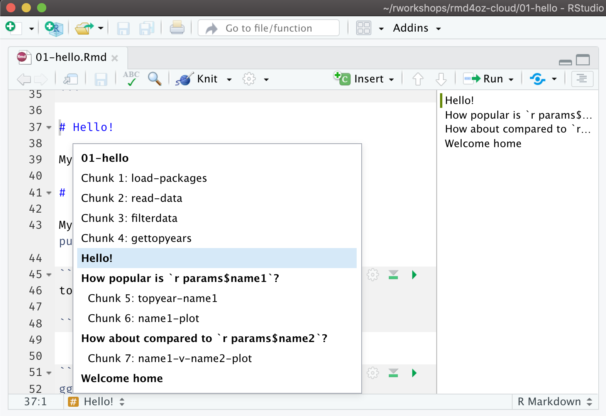

```{r setup, include=FALSE}
options(htmltools.dir.version = FALSE)
episode_counter <- 0
knitr::opts_chunk$set(
  collapse = TRUE,   
  comment = "#>"
)
```

```{r packages, include=FALSE}
library(countdown)
library(ymlthis)
library(tidyverse)
library(bakeoff)
library(extrafont)
# update those defaults
update_font_defaults <- function(font_choice = "Lato") {

    ggplot2::update_geom_defaults("text", list(family = font_choice))
    ggplot2::update_geom_defaults("label", list(family = font_choice))
    
}

theme_bakeoff <- function(font_choice = "Lato"){ 
  
  update_font_defaults()
  
  ggplot2::theme_minimal(base_family = font_choice)
  
}
ggplot2::theme_set(theme_bakeoff())
```


class: title-slide, center, middle

<span class="fa-stack fa-4x">
  <i class="fa fa-circle fa-stack-2x" style="color: #ffffffcc;"></i>
  <strong class="fa-stack-1x" style="color:#e7553c;">`r rmarkdown::metadata$session`</strong>
</span> 

# `r rmarkdown::metadata$title`

## `r rmarkdown::metadata$subtitle`

### `r rmarkdown::metadata$author` &#183; RStudio

#### [`r params$site_link`](`r params$site_link`)


---
class: middle, center

.pull-left[
# <i class="fas fa-wifi"></i>

Wifi network name  

`r params$wifi_network`

]

.pull-left[
# <i class="fas fa-key"></i>

Wifi password

`r params$wifi_password`

]

---
class: middle, center

# <i class="fas fa-cloud"></i>

# Go here and log in (free):

[`r params$cloud_link`](`r params$cloud_link`)

---
class: middle, center

| Time          | Activity                                                      |
|:--------------|:--------------------------------------------------------------|
| 09:00 - 10:30 | Session 1 (R Markdown Basics)                                 |
| 10:30 - 11:00 | *Break* `r emo::ji("coffee")`                                 |
| 11:00 - 12:30 | Session 2 (Advanced R Markdown)                               |
| 12:30 - 01:30 | *Lunch* `r emo::ji("bento")`                                  |
| 01:30 - 03:00 | Session 3 (Templates)                                         |
| 03:00 - 03:30 | *Break* `r emo::ji("tea")`                                    |
| 03:30 - 05:00 | Session 4 (Collections)                                       |

---
layout: true

<div class="my-footer"><span>`r params$site_link`</span></div>

---
background-image: url(images/hello-red.jpg)
background-position: top center
background-size: 100%
class: middle, center

.pull-left[
### Alison Hill  
[<i class="fab fa-github"></i> @apreshill](https://github.com/apreshill)  
[<i class="fab fa-twitter"></i> @apreshill](https://twitter.com/apreshill)

]

.pull-right[
### Emi Tanaka  
[<i class="fab fa-github"></i> @emitanaka](https://github.com/emitanaka)  
[<i class="fab fa-twitter"></i> @statsgen](https://twitter.com/statsgen)

]

.footnote[All content is CC-BY. All art (unless otherwise noted) is by [Desirée De Leon](https://desiree.rbind.io/), CC-BY-NC-ND.]

---

```{r child="what-is-rmd.Rmd"}

```

---

.left-column[
<span class="fa-stack fa-4x">
  <i class="fa fa-circle fa-stack-2x" style="color: #f2e255"></i>
  <strong class="fa-stack-1x" style="color: #fff;">?</strong>
</span> 
]

.right-column[

# What is R Markdown?

1. ["An authoring framework for data science."](https://rmarkdown.rstudio.com/lesson-1.html) (`r emo::ji("heavy_check_mark")`)

1. [A document format (`.Rmd`).](https://bookdown.org/yihui/rmarkdown/) (`r emo::ji("heavy_check_mark")`)

1. [An R package named `rmarkdown`.](https://rmarkdown.rstudio.com/docs/) (`r emo::ji("heavy_check_mark")`)

1. ["A file format for making dynamic documents with R."](https://rmarkdown.rstudio.com/articles_intro.html) (`r emo::ji("heavy_check_mark")`)

1. ["A tool for integrating text, code, and results."](https://r4ds.had.co.nz/communicate-intro.html) (`r emo::ji("heavy_check_mark")`)

1. ["A computational document."](http://radar.oreilly.com/2011/07/wolframs-computational-documen.html) (`r emo::ji("heavy_check_mark")`)

1. Wizardry. (`r emo::ji("wizard")`)

]

---
class: middle, center

# Change your mental model

.pull-left[

### Source &harr; output

```{r echo=FALSE, out.width="50%"}
knitr::include_graphics("images/word.png")
```

]

.pull-right[

### Source &rarr; output

```{r echo=FALSE, out.width="50%"}
knitr::include_graphics("images/rmd-file.png")
```

]

---
class: middle, center

# Change your mental model

.pull-left[

### Source &harr; output

```{r echo=FALSE, out.width="50%"}
knitr::include_graphics("images/haba-elise.jpg")
```

]

.pull-right[

### Source &rarr; output

```{r echo=FALSE, out.width="50%"}
knitr::include_graphics("images/doll.png")
```

]

---
background-image: url(images/welliewishers/Slide1.png)
background-size: cover
class: top, center

.footnote[https://www.americangirl.com/shop/c/welliewishers]

---
background-image: url(images/welliewishers/Slide2.png)
background-size: cover
class: top, center

.footnote[https://www.americangirl.com/shop/c/welliewishers]

---
class: middle, inverse, center

# Same ~~doll~~ source

# Different occasions

---
class: middle, center

# `html_document`

```{r echo=FALSE, out.width="40%"}
knitr::include_graphics("images/doll.png")
```

---

.left-column[

# <i class="fab fa-github"></i>

]

.right-column[

# Go here:

[`r params$github_link`](`r params$github_link`)

Click on "Use this template" (make sure you are logged in)

```{r echo=FALSE}
knitr::include_graphics("images/cloud-from-template.png")
```

]

---

.left-column[

# <i class="fab fa-github"></i>

]

.right-column[

# In your repo

Click on green button, then the clipboard to copy HTTPS

```{r echo=FALSE}
knitr::include_graphics("images/cloud-from-https.png")
```
]

---

.left-column[

# <i class="fas fa-cloud"></i>

]

.right-column[

# Go to rstudio.cloud:

[`r params$cloud_link`](`r params$cloud_link`)

1. Join space > Click on "Projects" (nothing there)

1. New Project from GitHub Repo

1. Use **your** HTTPS link:


  ```{r echo=FALSE, out.width='50%'}
  knitr::include_graphics("images/cloud-from-git.png")
  ```

1. Name your project

]

---

.left-column[

# <i class="fas fa-cloud"></i>

]

.right-column[

# Last step!

I promise! Still in rstudio.cloud:

```{r eval=FALSE}
library(usethis)
use_git_config(
  scope = "project",
  user.name = "Jane",
  user.email = "jane@example.org"
)
```

]

---
class: your-turn

# Your turn

Find a partner and look at `01-bakeoff-report.Rmd` together. 
Look at the source, then `r emo::ji("yarn")` **Knit** to HTML.

Try to identify these parts in the source and the output:

1. The **metadata**

1. The **text** 

1. The **code**

1. The **output**

**If this was easy**, try to find all code that produces a *plot*.


```{r echo = FALSE}
countdown(minutes = 5)
```

---
class: live-code

# Basic anatomy I

We look at the source anatomy for `01-bakeoff-report.Rmd` together:

1. The **metadata**

1. The **text** 

1. The **code**
    
---
class: center, middle

```{r knit-html, echo=FALSE, out.width="50%"}
knitr::include_graphics("images/Knit-to-html.jpg")
```

---
class: center, middle

```{r do-live, echo=FALSE, out.width="50%"}
knitr::include_graphics("images/doc-live.jpg")
```

---
class: live-code

# Basic anatomy II

We look at the output anatomy for `01-bakeoff-report.Rmd` together:

1. The **metadata**

1. The **text** 

1. The **code**

1. The **output**


---
background-image: url(images/rmarkdown_wizards.png)
background-size: contain

.footnote[Art by [Allison Horst](https://twitter.com/allison_horst?lang=en)]

---
class: middle, center

# What is inside?


---
class: middle, center, inverse

<span class="fa-stack fa-4x">
  <i class="fa fa-circle fa-stack-2x" style="color: #fff;"></i>
  <strong class="fa-stack-1x" style="color:#17a2b8;">`r (episode_counter <- episode_counter + 1)` </strong>
</span> 

--

# Metadata

---

# metadata: YAML

.pull-left[

_"YAML Ain't Markup Language"_


```yaml
---
key: value
---
```

]

.pull-right[

```{r echo=FALSE, out.width="75%", fig.align='center'}
knitr::include_graphics("images/orchestra.jpg")
```

]

---
class: middle, center

# Output options

---

# Save output options in your YAML

.pull-left[

```{r echo = FALSE}
yml_empty() %>% 
  yml_title("The Great British Bake Off") %>% 
  yml_output(html_document()) %>% 
  asis_yaml_output()
```

```{r echo = FALSE}
yml_empty() %>% 
  yml_title("The Great British Bake Off") %>% 
  yml_output(html_document(toc = TRUE)) %>%  
  asis_yaml_output()
```


]

.pull-right[

```{r echo=FALSE, out.width="75%", fig.align='center'}
knitr::include_graphics("images/orchestra.jpg")
```

]

---
class: your-turn

# Your turn

## Add output options to YAML

Use `?html_document` from your R console to:

1. Add a floating table of contents

1. Add a theme

`r emo::ji("yarn")` **Knit** to HTML to see the output.

**If this was easy**, try to embed the `Rmd` source code to download.

_psst...answers on the next slide..._

```{r echo = FALSE}
countdown(minutes = 3)
```

---
class: your-turn

# Answers

```{r echo = FALSE}
yml_empty() %>% 
  yml_title("The Great British Bake Off") %>% 
  yml_output(html_document(toc = TRUE,
                           toc_float = TRUE,
                           theme = "flatly",
                           code_download = TRUE)) %>% 
  asis_yaml_output()
```

---

# Parameters

```{r echo = FALSE}
yml_empty() %>% 
  yml_title("The Great British Bake Off") %>% 
  yml_output(html_document(toc = TRUE,
                           toc_float = TRUE,
                           theme = "flatly",
                           code_download = TRUE)) %>% 
  yml_params(
    series = '1'
  ) %>% 
  asis_yaml_output()
```

---
class: your-turn

# Your turn

.pull-left[

Change this:

```{r echo = FALSE}
yml_empty() %>% 
  yml_title("The Great British Bake Off") %>% 
  yml_output(html_document(toc = TRUE,
                           toc_float = TRUE,
                           theme = "flatly",
                           code_download = TRUE)) %>% 
  yml_params(
    series = '1'
  ) %>% 
  asis_yaml_output()
```

]

.pull-right[

To this:

```{r echo = FALSE}
yml_empty() %>% 
  yml_title("The Great British Bake Off") %>% 
  yml_output(html_document(toc = TRUE,
                           toc_float = TRUE,
                           theme = "flatly",
                           code_download = TRUE)) %>% 
  yml_params(
    series = '2'
  ) %>% 
  asis_yaml_output()
```

]

Now click on knit button and pick __"Knit with Parameters."__ How is this different from what you did above?


```{r echo = FALSE}
countdown(minutes = 3)
```

---
class: inverse, center, middle

<span class="fa-stack fa-4x">
  <i class="fa fa-circle fa-stack-2x" style="color: #fff;"></i>
  <strong class="fa-stack-1x" style="color:#17a2b8;">`r (episode_counter <- episode_counter + 1)` </strong>
</span> 

--

# Text

---

# <center>Headers</center>

--

.pull-left[
```markdown
# HEADER 1

## HEADER 2

### HEADER 3

#### HEADER 4

##### HEADER 5

###### HEADER 6
```
]

--

.pull-right[
# HEADER 1

## HEADER 2

### HEADER 3

#### HEADER 4

##### HEADER 5

###### HEADER 6
]

---
class: middle, center


```{r echo=FALSE, out.width='80%'}

```


---

# <center>Text</center>

--

.pull-left[
```markdown
 **The Great British Bake Off** 
(often abbreviated to _Bake Off_ or _GBBO_) 
is a British television baking competition.
```
]

--

.pull-right[

**The Great British Bake Off** 
(often abbreviated to _Bake Off_ or _GBBO_) 
is a British television baking competition. 

]

---
class: top

# <center>Lists</center>

--

.pull-left[

```markdown
The original cast included:

- Sue Perkins (_host_)
- Mel Giedroyc (_host_)
- Mary Berry (_judge_) and
- Paul Hollywood (_judge_).

In each episode, the amateur bakers are 
given **three challenges** based on that 
week's theme.

1. a signature bake,
1. a technical challenge,
1. a show-stopper.
```

]

--

.pull-right[

The original cast included:

- Sue Perkins (_host_)
- Mel Giedroyc (_host_)
- Mary Berry (_judge_) and
- Paul Hollywood (_judge_).

In each episode, the amateur bakers are 
given **three challenges** based on that 
week's theme.

1. a signature bake,
1. a technical challenge,
1. a show-stopper.

]

---

# <center>Images</center>

--

.pull-left[
```markdown
Competitive baking, such as making Victoria 
sponge (_pictured_), is part of the classic 
English village fête,
which inspired the series.

```
]

--

.pull-right[
Competitive baking, such as making Victoria 
sponge (_pictured_), is part of the classic 
English village fête,
which inspired the series.

]

---

# <center>Links</center>

--

.pull-left[
```markdown
Competitive baking, such as making Victoria 
sponge (_pictured_), is part of the classic 
English village fête,
which inspired the series.

[Photo](https://en.wikipedia.org/)


```
]

--

.pull-right[
Competitive baking, such as making Victoria 
sponge (_pictured_), is part of the classic 
English village fête,
which inspired the series.

[Photo](https://en.wikipedia.org/)


]

---
name: 03-formative
class: middle

# Pop quiz

--

.pull-left[

How do you add headers in Markdown?

`! Header`

`- Header`

`# Header`

`1. Header`

]

--

.pull-right[

What about lists? Bulleted? Numbered?

`! Item 1`

`- Item 1`

`# Item 1`

`1. Item 1`

]

---
class: inverse, center, middle

<span class="fa-stack fa-4x">
  <i class="fa fa-circle fa-stack-2x" style="color: #fff;"></i>
  <strong class="fa-stack-1x" style="color:#17a2b8;">`r (episode_counter <- episode_counter + 1)` </strong>
</span> 

--

# <i class="fab fa-r-project"></i> code

---

# Code chunks

.pull-left[

````
```{r}`r ''`
ratings %>% 
  filter(series == 1) %>% 
  top_n(1, viewers_7day)
```
````

What is the fate of this chunk?

]

--

.pull-right[

```{r}
ratings %>% 
  filter(series == 1) %>% 
  top_n(1, viewers_7day)
```

]

---

# Code chunks

.pull-left[

````
```{r}`r ''`
top_viewers <- ratings %>% 
  filter(series == 1) %>% 
  top_n(1, viewers_7day)
```
````

What fate do you predict here?

]

--

.pull-right[

```{r}
top_viewers <- ratings %>% 
  filter(series == 1) %>% 
  top_n(1, viewers_7day)
```

  
]

---

# Code chunks

.pull-left[

````
```{r}`r ''`
top_viewers <- ratings %>% 
  filter(series == 1) %>% 
  top_n(1, viewers_7day)
top_viewers
```
````

]

--

.pull-right[

```{r}
top_viewers <- ratings %>% 
  filter(series == 1) %>% 
  top_n(1, viewers_7day)
top_viewers
```

  
]

---

# Code chunks

.pull-left[

```{r include = FALSE}
viewers <- ratings %>% 
  filter(series == 1) %>% 
  select(series:viewers_28day) %>% 
  pivot_longer(starts_with("viewers"), 
    names_to = "days", 
    names_prefix = "viewers_", 
    values_to = "viewers"
  ) 
```


````
```{r}`r ''`
ggplot(viewers, aes(episode, viewers, 
                    colour = days, 
                    group = days)) + 
  geom_point() + 
  geom_line() + 
  labs(x = "Episode", 
       y = "Viewers (millions)") +
  expand_limits(y = 0) 
```
````

What about this one?

]

--

.pull-right[

```{r fig.retina=3, out.width="60%", fig.align='center'}
ggplot(viewers, aes(episode, viewers, 
                    colour = days, 
                    group = days)) + 
  geom_point() + 
  geom_line() + 
  labs(x = "Episode", 
       y = "Viewers (millions)") +
  expand_limits(y = 0) 
```

]

---
class: live-code

# Adding/running chunks

Together we:

1. Add chunks with button or:

   Command (or Cmd) `⌘` + Option (or Alt) `⌥` +  `i` (Mac)
  
   Ctrl + Alt + `i` (Windows/Linux)
   
1. Run chunks by:

   Run current chunk button (interactive)
   
   Knit button / run all chunks


---

# Inline code

.pull-left[

The top viewed episode in series 1 was episode
``` `r knitr::inline_expr('top_viewers %>% pull(episode)')` ```

]

--

.pull-right[

The top viewed episode in series 1 was episode
`r top_viewers %>% pull(episode)`

]

---
class: inverse, center, middle

<span class="fa-stack fa-4x">
  <i class="fa fa-circle fa-stack-2x" style="color: #fff;"></i>
  <strong class="fa-stack-1x" style="color:#17a2b8;">`r (episode_counter <- episode_counter + 1)` </strong>
</span> 

--

# Output

---

# Chunk options

.pull-left[

````
```{r}`r ''`
glimpse(ratings)
```
````

]

.pull-right[

```{r}
glimpse(ratings)
```

]

---

# echo

.pull-left[

````
```{r echo=FALSE}`r ''`
glimpse(ratings)
```
````

]

.pull-right[

```{r echo=FALSE}
glimpse(ratings)
```

]

---

# eval

.pull-left[

````
```{r eval=FALSE}`r ''`
glimpse(ratings)
```
````

]

.pull-right[

```{r eval=FALSE}
glimpse(ratings)
```

]

---

# include

.pull-left[

````
```{r include=FALSE}`r ''`
glimpse(ratings)
```
````

]

.pull-right[

```{r include=FALSE}
glimpse(ratings)
```

]

---

# results

.pull-left[

````
```{r echo=TRUE, results='hide'}`r ''`
glimpse(ratings)
```
````

]

.pull-right[

```{r echo=TRUE, results='hide'}
glimpse(ratings)
```

]

---

# message / warning


---

# message / warning

.pull-left[

````
```{r message=FALSE, warning=FALSE}`r ''`
library(tidyverse)
```
````

]

.pull-right[

```{r message=FALSE, warning=FALSE}
library(tidyverse)
```

]

---

.left-column[
# Default options
]

.right-column[
```{r}
str(knitr::opts_chunk$get())
```

]

---

# Chunk option take-aways

+ Place between curly braces<br>`{r option=value}`

+ Multiple options separated by commas<br>`{r option1=value, option2=value}`

+ Careful! The `r` part is the **code engine** (other engines possible)

---

# Chunk labels

.pull-left[

````
```{r peek, echo=FALSE, results='hide'}`r ''`
glimpse(ratings)
```
````

]

.pull-right[

+ Place between curly braces<br>`{r label}`

+ Separated options with commas<br>`{r label, option1=value}`

+ Careful! No duplicate chunk labels

    ````
    ```{r peek}`r ''`
    head(ratings)
    ```
    ````

    ```
    Error in parse_block(g[-1], g[1], params.src) : 
      duplicate label 'peek'
    Calls: <Anonymous> ... process_file -> split_file -> lapply -> FUN -> parse_block
    Execution halted
    ```

]

???

how can we make it easier on ourselves to explore the code in here?

show how to add chunk labels and view in IDE interactively

---
class: middle, center

# Pet or livestock?

.pull-left[


]

.pull-right[


]

.footnote[https://masalmon.eu/2017/08/08/chunkpets/; https://www.express.co.uk/news/nature/770211/pet-sheep-lamb-rasied-dog-farm-nature]

---
class: middle, center

# A good chunk label

.pull-left[

### Good

`my-plot`

`myplot`

`myplot1`

`myplot-1`

`MY-PLOT`

]

.pull-right[

### Bad

`my_plot`

`my plot`

everything else!

]

---

# The setup chunk


.pull-left[

````
```{r setup, include=FALSE}`r ''`
knitr::opts_chunk$set(
  collapse = TRUE,   
  comment = "#>", 
  out.width = "100%" 
)
```
````

]

.pull-right[

+ A special chunk label: `setup`

+ Typically #1

+ All following chunks will use these options (i.e., sets global chunk options)

+ **Tip**: set `include=FALSE`

+ You can (and should) use individual chunk options too

]

---
class: live-code

# Adding a setup chunk

We do this together:

1. Add `fig.path = "figs/"` as a knitr code chunk option for a single plot (watch what happens if we don't include the backslash!)

1. Knit and behold

1. We add it to a global setup chunk.


---
class: your-turn

# Your turn

Customize this report.

1. Label the code chunk with your plot in it.

1. Add your setup chunk.

1. Use the RStudio outline pane; rejoice!

1. Build a [graphical user interface](https://bookdown.org/yihui/rmarkdown/params-knit.html#the-interactive-user-interface) for parameters.

__If this was easy,__ try adding a parameter for color palette and add in a package like [wesanderson](https://github.com/karthik/wesanderson) &mdash; use the parameter in our ggplot2 code.

_psst...`01-bakeoff-report-alison.Rmd` is there..._

_psst-psst...answers on the next slide..._

```{r echo = FALSE}
countdown(minutes = 5)
```

---
class: your-turn

# Answers


```yaml
params:
  series:
    label: "Series:"
    value: 1
    input: numeric
    min: 1
    max: 9
    step: 1
  palette: 
    label: "Wes Anderson palette:"
    value: GrandBudapest1
    input: select
    choices: [GrandBudapest1, Darjeeling1, Darjeeling2, FantasticFox1, Royal2]
```


---
class: inverse, middle, center

# `r emo::ji("postbox")`

.large[https://app.netlify.com/drop]

---
class: live-code

# Clean your url up

We live demo changing the main "landing page" name to `index.Rmd`, knit, then deploy again: https://app.netlify.com/drop

---
class: middle, center

# Take-aways

--

`r emo::ji("heavy_check_mark")` **Document your document:** use YAML to set up meaningful metadata

--

`r emo::ji("heavy_check_mark")` **Style your document:** use YAML to add options to your chosen output format

--

`r emo::ji("heavy_check_mark")` **Organize your text:** use markdown headers with `#`

--

`r emo::ji("heavy_check_mark")` **Organize your code:** use `knitr` chunk labels

--

`r emo::ji("heavy_check_mark")` **Style your text:** use markdown **bold**, _italics_, <i class="fas fa-list-ul"></i> bullets, and <i class="fas fa-list-ol"></i> lists

--

`r emo::ji("heavy_check_mark")` **Style your output:** use `knitr` chunk options

--

`r emo::ji("yarn")` early, `r emo::ji("yarn")` often


---
class: middle, center

# `r emo::ji("stopwatch")`

# Time for a break!

```{r echo = FALSE}
countdown(minutes = 30, update_every = 15)
```


