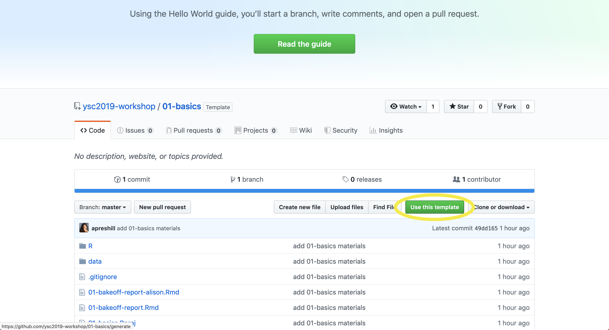
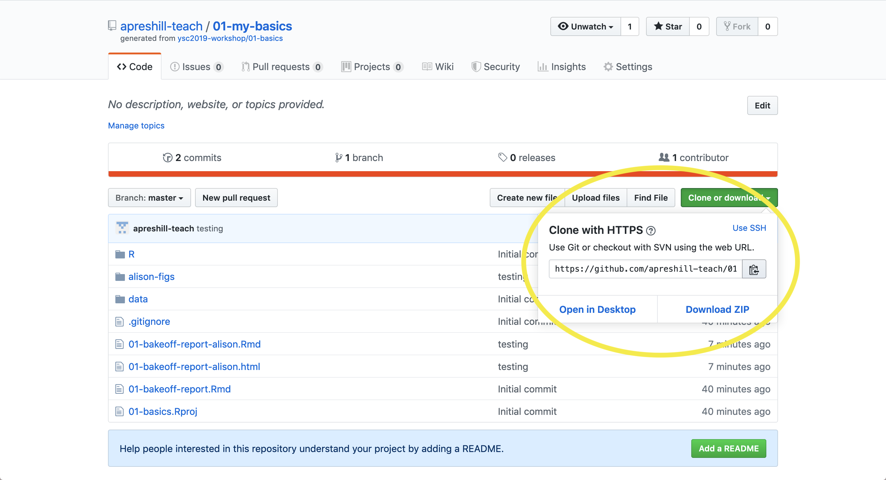
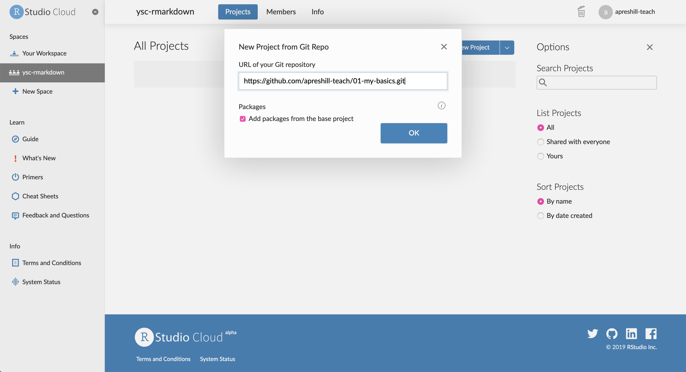

```{r setup, include=FALSE}
options(htmltools.dir.version = FALSE)
episode_counter <- 0
knitr::opts_chunk$set(
  collapse = TRUE,   
  comment = "#>"
)
```

```{r packages, include=FALSE}
library(countdown)
library(ymlthis)
```


class: title-slide, center, middle

<span class="fa-stack fa-4x">
  <i class="fa fa-circle fa-stack-2x" style="color: #ffffffcc;"></i>
  <strong class="fa-stack-1x" style="color:#e7553c;">`r rmarkdown::metadata$session`</strong>
</span> 

# `r rmarkdown::metadata$title`

## `r rmarkdown::metadata$subtitle`

### `r rmarkdown::metadata$author` &#183; RStudio

#### [`r params$site_link`](`r params$site_link`)


---
layout: true

<div class="my-footer"><span>`r params$site_link`</span></div>

---
class: middle, center, inverse

<span class="fa-stack fa-4x">
  <i class="fa fa-circle fa-stack-2x" style="color: #fff;"></i>
  <strong class="fa-stack-1x" style="color:#17a2b8;">`r (episode_counter <- episode_counter + 1)` </strong>
</span> 

--

# Templates

---
class: live-code

# Demo using a template

+ The one that ships with `rmarkdown`
  + _File > New File > R Markdown_; select "Document"

+ One from my package
  + _File > New File > R Markdown_; select "From Template"


---
# What are we doing? 

I built a package for us to use.

---

.left-column[

# <i class="fab fa-github"></i>

]

.right-column[

# Go here:

[`r params$github_link`](`r params$github_link`)

Click on "Use this template" (make sure you are logged in)

```{r echo=FALSE}

```

]

---

.left-column[

# <i class="fab fa-github"></i>

]

.right-column[

# In your repo

Click on green button, then the clipboard to copy HTTPS

```{r echo=FALSE}

```
]

---

.left-column[

# <i class="fas fa-cloud"></i>

]

.right-column[

# Go to rstudio.cloud:

[`r params$cloud_link`](`r params$cloud_link`)

1. Join space > Click on "Projects" (nothing there)

1. New Project from GitHub Repo

1. Use **your** HTTPS link:


  ```{r echo=FALSE, out.width='50%'}
  
  ```

1. Name your project

]

---

.left-column[

# <i class="fas fa-cloud"></i>

]

.right-column[

# Last step!

I promise! Still in rstudio.cloud:

```{r eval=FALSE}
library(usethis)
use_git_config(
  scope = "project",
  user.name = "Jane",
  user.email = "jane@example.org"
)
```

]

---
class: middle, center, inverse

<span class="fa-stack fa-4x">
  <i class="fa fa-circle fa-stack-2x" style="color: #fff;"></i>
  <strong class="fa-stack-1x" style="color:#17a2b8;">`r (episode_counter <- episode_counter + 1)` </strong>
</span> 

--

# Packages

---
class: live-code

# Basic package anatomy

- NAMESPACE
- DESCRIPTION

```{r eval=FALSE}
usethis::create_package(here::here())
```

---
class: live-code

# Basic template anatomy

+ `template.yaml`
+ `skeleton/skeleton.Rmd`

```{r eval=FALSE}
usethis::use_rmarkdown_template("01-rmd")
```

---
class: middle, inverse, center

# DO NOT KNIT!

Do not try to knit the skeleton.Rmd


---
class: your-turn

# Your turn

Open up my existing `basic-rmd` template &mdash; find in `inst/rmarkdown/templates/basic-rmd`.

1. Add your name and a title to this template. 

1. Edit the YAML for the built-in `html_document` output format. Consider adding some of your favorite output options for the HTML format (theme? floating toc? parameters?)

1. Edit the content. Add a good `knitr` setup chunk at the top.

```{r echo=FALSE}
countdown(minutes=5)
```


---
class: live-code

# Build package

We build the package using "Install and Restart" and confirm we see it locally.

---
class: live-code

# Use the template

We demo creating a new project in RStudio and using the template there so as not to pollute our package project.


---
class: middle, center, inverse

<span class="fa-stack fa-4x">
  <i class="fa fa-circle fa-stack-2x" style="color: #fff;"></i>
  <strong class="fa-stack-1x" style="color:#17a2b8;">`r (episode_counter <- episode_counter + 1)` </strong>
</span> 

--

# Custom Styles

---
class: live-code

# Let's do a custom one

now we talk about adding supporting files like a logo and css. See my `custom-rmd` template.

---
class: your-turn

# Your turn

Figure out how the `custom-rmd` template works. Maybe talk with a partner/neighbor.

```{r echo=FALSE}
countdown(minutes=5)
```

---
class: middle, center, inverse

<span class="fa-stack fa-4x">
  <i class="fa fa-circle fa-stack-2x" style="color: #fff;"></i>
  <strong class="fa-stack-1x" style="color:#17a2b8;">`r (episode_counter <- episode_counter + 1)` </strong>
</span> 

--

# Extension Formats

---
class: live-code

# Let's look at my slide template

Check out `custom-xaringan` template together.

---
class: your-turn

# Your turn

Now try creating a fresh template on your own, and use an extension output format like:

+ `distill::distill_article`

+ `bookdown::html_document2`

+ `xaringan::moon_reader`

+ `flexdashboard::flexdashboard`

```{r echo=FALSE}
countdown(minutes=5)
```

---
class: middle, center, inverse

<span class="fa-stack fa-4x">
  <i class="fa fa-circle fa-stack-2x" style="color: #fff;"></i>
  <strong class="fa-stack-1x" style="color:#17a2b8;">`r (episode_counter <- episode_counter + 1)` </strong>
</span> 

--

# Custom Formats

---

# Possible!

https://bookdown.org/yihui/rmarkdown/new-formats.html


---
class: middle, center, inverse

# `r emo::ji("stopwatch")`

# Time for a break!

```{r echo = FALSE}
countdown(minutes = 30, update_every = 15)
```


