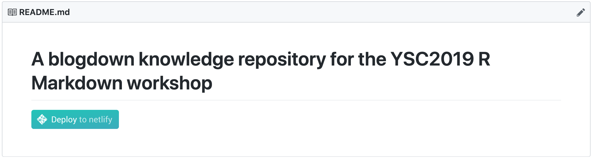

```{r setup, include=FALSE}
options(htmltools.dir.version = FALSE)
```

```{r packages, include=FALSE}
library(countdown)
library(tidyverse)
library(magick)
```


class: title-slide, center, middle

<span class="fa-stack fa-4x">
  <i class="fa fa-circle fa-stack-2x" style="color: #ffffffcc;"></i>
  <strong class="fa-stack-1x" style="color:#e7553c;">`r rmarkdown::metadata$session`</strong>
</span> 

# `r rmarkdown::metadata$title`

## `r rmarkdown::metadata$subtitle`

### `r rmarkdown::metadata$author` &#183; RStudio

#### [`r params$site_link`](`r params$site_link`)

---
layout: true

<div class="my-footer"><span>`r params$site_link`</span></div>

---
name: blogdown
class: inverse, middle, center

# What is blogdown?

---
template: blogdown

```{r out.width="25%", echo = FALSE}
knitr::include_graphics("https://raw.githubusercontent.com/rstudio/hex-stickers/master/PNG/blogdown.png")
```


---
template: blogdown

--

An <i class="fab fa-r-project"></i> package...

--

that lets you create websites in 


???

So what is blogdown?

It is an R package... can I get a show of hands for everyone here who uses R? OK keep them up...

That lets you create websites in RStudio...can I get all of you R users to keep your hand up if you use RStudio, so lower your hand if you don't use RStudio

Perfect, thanks! So this is one of the first perks of blogdown, which is that you can build a website in the RStudio IDE using tools you are familiar with, and you won't need very much else to start.

---


??? 

The package helps you to use a static site generator named Hugo. If you didn't understand much of the last sentence I said, that is OK! The main thing you'll want to know is that Hugo gives you over 100 themes to choose from, so you can create a custom-looking website, in the same way that Wordpress offers website themes.

One difference here is that you own your content, and the entire pipeline for creating it, from start to finish, which I think is a huge benefit to users. You control what, you control when, you control how.


---
class: center, middle, inverse

# `r emo::ji("moneybag")` BONUS `r emo::ji("moneybag")`

--


# You can use R Markdown!


???

And a bonus is that because blogdown is built on top of R Markdown, you can include code and output in your website content.

This means you can include R code, but also Python, Julia, C++, any language engine supported in R Markdown.

This makes blogdown ideal for data scientists.

So what does a blogdown site look like?

---
background-image: url(images/awesome-blogdown/amber.png)
background-size: contain

---
background-image: url(images/awesome-blogdown/openscapes.png)
background-size: contain

---
background-image: url(images/awesome-blogdown/earo.png)
background-size: contain

---
background-image: url(images/awesome-blogdown/desiree.png)
background-size: contain

---
background-image: url(images/awesome-blogdown/maya.png)
background-size: contain

---
background-image: url(images/awesome-blogdown/dewey.png)
background-size: contain

---
background-image: url(images/awesome-blogdown/joyce.png)
background-size: contain

---
background-image: url(images/awesome-blogdown/therese.png)
background-size: contain

---
background-image: url(images/awesome-blogdown/dan.png)
background-size: contain
  
---
background-image: url(images/awesome-blogdown/emi-showcase.gif)
background-size: cover


---
class: inverse, middle, center

# `r emo::ji("sparkles")` Quiz! `r emo::ji("sparkles")`

```{r echo = FALSE}
countdown(minutes = 2)
```


For <i class="fab fa-r-project"></i> users, why `blogdown` instead of [WordPress, Tumblr, Medium.com, Blogger.com]?

Chat with a neighbor.

--

Some answers:

+ Own your content
+ Use R Markdown to create content (CODE CHUNKS)
+ Integrated within RStudio (my happy place)
+ Hugo themes
+ Is not Jekyll / PHP
+ Agnostic to publishing platform (= portable)


---
class: inverse, middle

# What does it actually do?

.left-column[

```{r out.width = "50%", echo = FALSE}
knitr::include_graphics("https://gohugo.io/img/hugo.png")
```

]

.right-column[


```{r eval = FALSE}
install_hugo()

hugo_version()

update_hugo() 
```
]

---
class: inverse, middle

# What does it actually do?

.left-column[

```{r out.width = "50%", echo = FALSE}
knitr::include_graphics("https://raw.githubusercontent.com/rstudio/hex-stickers/master/PNG/blogdown.png")
```

]


.right-column[


```{r eval = FALSE}
new_site()

new_content() # via add-in

serve_site() # ditto, via add-in
```


]


---
class: middle, inverse, center

# `r emo::ji("swimmer")`

---
class: middle, center, inverse

# Go here

https://github.com/ysc2019-workshop/04-blogdown

```{r echo=FALSE}

```

---
class: middle, inverse, center

# `r emo::ji("rocket")`


---
class: middle, center

```{r echo = FALSE, out.width="70%"}
list_png <- c("images/01-blogdown-github.png",
              "images/02-blogdown-clone.png",
              "images/03-blogdown-build.png",
              "images/04-blogdown-netlify.png")

list_png %>% 
  map(image_read) %>% # reads each path file
  image_join() %>% # joins image
  image_scale("3000") %>% 
  image_animate(fps = .5)  # animates, can opt for number of loops
```


---
class: live-code

# Clone locally

I'll demo cloning my freshly deployed site repo into RStudio.

We'll serve site and pray...

```{r eval=FALSE}
# is your version less than the minimum version?
hugo_version() 

# if yes, then do this + restart
update_hugo(force = TRUE)
```

---
class: middle, center

```{r echo = FALSE, out.width="80%"}
list_png <- c("images/blogdown-lifecycle/Slide1.png",
              "images/blogdown-lifecycle/Slide2.png",
              "images/blogdown-lifecycle/Slide3.png")

list_png %>% 
  map(image_read) %>% # reads each path file
  image_join() %>% # joins image
  image_scale("3000") %>% 
  image_animate(fps = .5)  # animates, can opt for number of loops
```

---
class: middle, center
```{r echo = FALSE, out.width = "80%"}
list_png <- c("images/blogdown-lifecycle/Slide3.png",
              "images/blogdown-lifecycle/Slide5.png",
              "images/blogdown-lifecycle/Slide6.png")

list_png %>% 
  map(image_read) %>% # reads each path file
  image_join() %>% # joins image
  image_scale("2000") %>% 
  image_animate(fps = .5)  # animates, can opt for number of loops
```

---
class: middle, center

```{r echo = FALSE, out.width = "80%"}
list_png <- c("images/blogdown-lifecycle/Slide7.png",
              "images/blogdown-lifecycle/Slide8.png",
              "images/blogdown-lifecycle/Slide9.png")

list_png %>% 
  map(image_read) %>% # reads each path file
  image_join() %>% # joins image
  image_scale("2000") %>% 
  image_animate(fps = .5)  # animates, can opt for number of loops
```

---
class: live-code

# The host's home tour

What to touch, and what not to touch.

---
class: your-turn

# Your turn

## Say goodbye to "Nelson Bighetti"

Find and edit the file `content/authors/admin/index.md`. If you want, add an `avatar.jpg` file too.


```{r echo=FALSE}
countdown(minutes=5)
```

---
class: live-code

# Serve site

---
class: your-turn

# Your turn

Let's start with the last thing you typically do to your home- decorate.

Open up the file `config/_default/params.toml`. Play with any of these configurations, but especially fonts/themes. You can see the ones designed by [Desirée De Leon](http://desiree.rbind.io/) in the `data/` folder.

```{r echo=FALSE}
countdown(minutes=5)
```
    
---
background-image: url(images/hugo/1.png)
background-size: cover

---
background-image: url(images/hugo/2.png)
background-size: cover

---
background-image: url(images/hugo/3.png)
background-size: cover

---
background-image: url(images/hugo/4.png)
background-size: cover

---
background-image: url(images/hugo/5.png)
background-size: cover

---
background-image: url(images/hugo/6.png)
background-size: cover

---
background-image: url(images/hugo/7.png)
background-size: cover

---
background-image: url(images/hugo/8.png)
background-size: cover

---
background-image: url(images/hugo/9.png)
background-size: cover

---
background-image: url(images/hugo/10.png)
background-size: cover

---
background-image: url(images/hugo/11.png)
background-size: cover

---
background-image: url(images/hugo/12.png)
background-size: cover

---
class: your-turn

# Your turn

With a partner, take an inventory of the rooms in your homes (in your `content/` folder). 
Which urls do you predict to work? Do they?

If this was easy, which are links are list layouts? Which are a single layouts?

```{r echo=FALSE}
countdown(minutes=5)
```

---
class: your-turn

# Your turn

Add new content to your `post/` room. Add series 9! 

If this was easy, try adding xaringan slides to `static/slides/`, and link to them in posts.

```{r echo=FALSE}
countdown(minutes=5)
```

---
background-image: url(images/hugo/13.png)
background-size: cover
class: inverse, left, middle

# Your 

# home 

# page

---
class: your-turn

# Your turn

Play with your landing page (`hero.md` text + images).

If this was easy, try activating other widgets; or creating a separate widget page.

```{r echo=FALSE}
countdown(minutes=5)
```


---
class: middle, center, inverse


# Time to wrap-up!

```{r echo = FALSE}
countdown(minutes = 15, update_every = 15)
```


